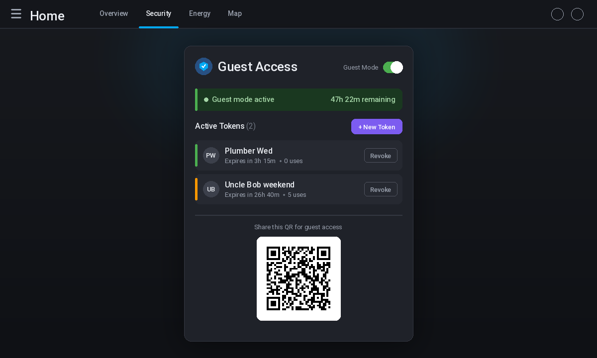

# Gatekeeper Guest Portal — Lovelace Card

A **Lovelace dashboard card** for [Gatekeeper HA](https://github.com/rusty4444/gatekeeper-ha) that provides a full UI for managing guest access tokens and toggling guest mode — all from your Home Assistant dashboard.



## Features

- **Guest Mode toggle** — Activate/deactivate guest mode with a single switch. Shows remaining time when auto-disable is active.
- **Token management** — Create, view, and revoke guest access tokens.
- **Token creation form** — Set label, duration, entity scopes, domain scopes, and allowed services per token.
- **QR code display** — In-browser QR code generation (no external API calls) for easy sharing.
- **Guest URL sharing** — Copy-to-clipboard or native share sheet (iOS/Android).
- **Token expiry indicators** — Color-coded status (ok / soon / expiring / revoked) with remaining time.

## Installation

### Via HACS (recommended)

1. Add this repository as a **Custom Repository** in HACS:
   - **URL:** `https://github.com/rusty4444/gatekeeper-card`
   - **Type:** `Lovelace`

2. Search for "Gatekeeper Guest Portal" in HACS and install.

3. Add the resource to your dashboard:
   ```
   /hacsfiles/gatekeeper-card/gatekeeper-card.js
   ```
   **Type:** JavaScript Module

4. Add the card to any Lovelace view:
   ```yaml
   type: custom:gatekeeper-card
   ```

### Manual Installation

1. Download `gatekeeper-card.js` from the [latest release](https://github.com/rusty4444/gatekeeper-card/releases).

2. Copy it to your `config/www/` directory.

3. Add as a resource in Lovelace (Settings → Dashboards → Resources):
   ```
   /local/gatekeeper-card.js
   ```
   **Type:** JavaScript Module

4. Add the card to any view.

## Configuration

```yaml
type: custom:gatekeeper-card
title: "Guest Access"        # Card title (default: "Guest Access")
show_qr: true                # Show QR code (default: true)
default_duration: 24         # Default token duration in hours (default: 24)
```

## Card Preview

The card displays:
- **Header** with title and guest mode toggle switch
- **Status banner** showing guest mode active/inactive state
- **Active Tokens** section with create/revoke controls and expiry indicators
- **Guest Access QR** section with scannable QR code, guest URL, and share/copy buttons

## Prerequisites

- [Gatekeeper HA](https://github.com/rusty4444/gatekeeper-ha) integration must be installed
- Home Assistant 2023.8+ (for `return_response` service call support)

## Development

```bash
# Install dependencies
npm install

# Build
npm run build

# Watch mode
npm run watch
```

The build output is written to `dist/gatekeeper-card.js`.

## License

MIT
